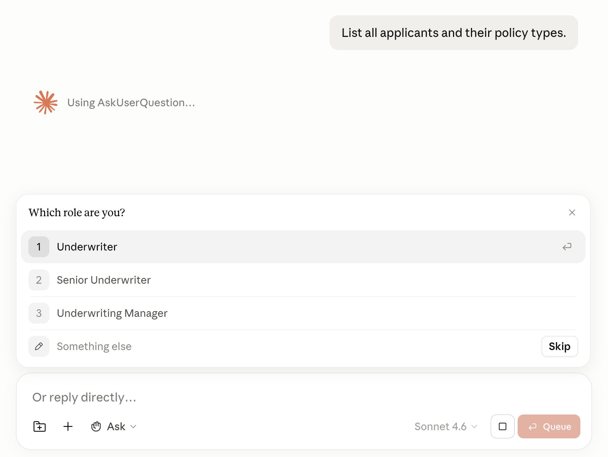
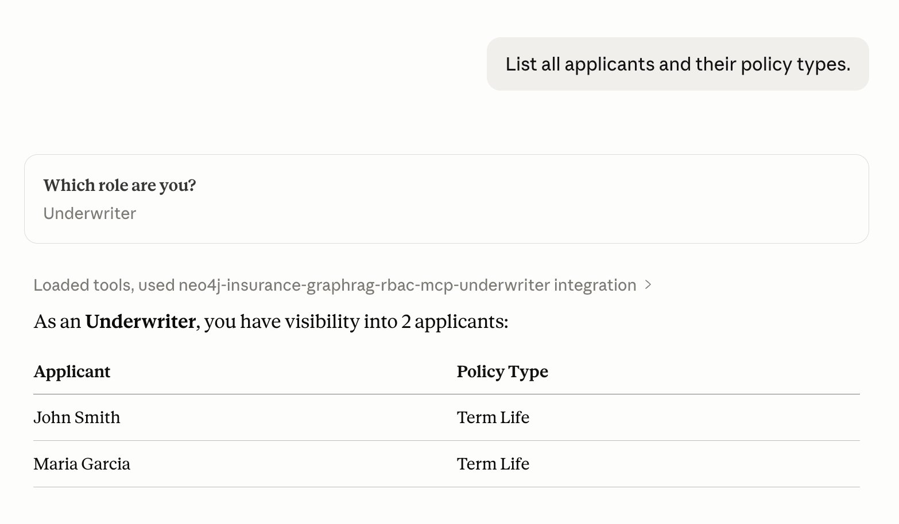
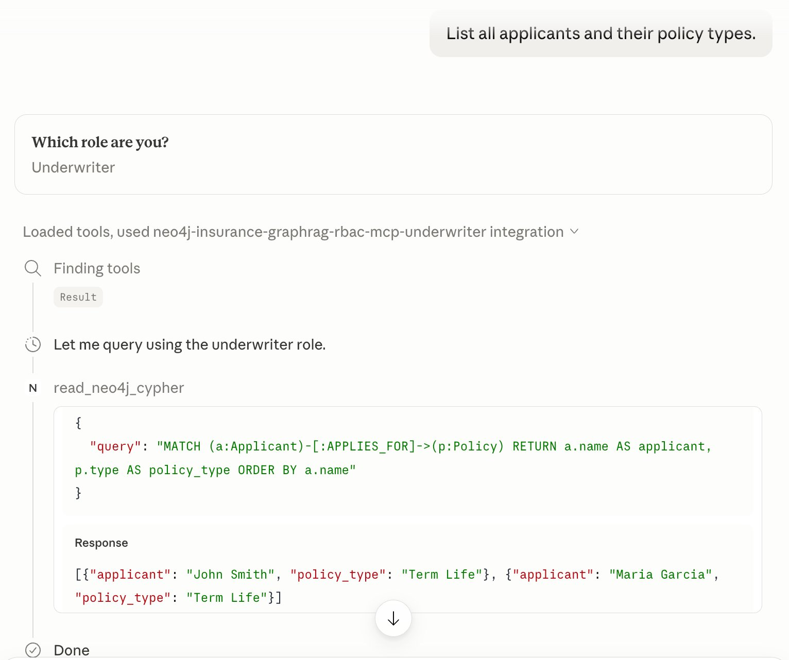
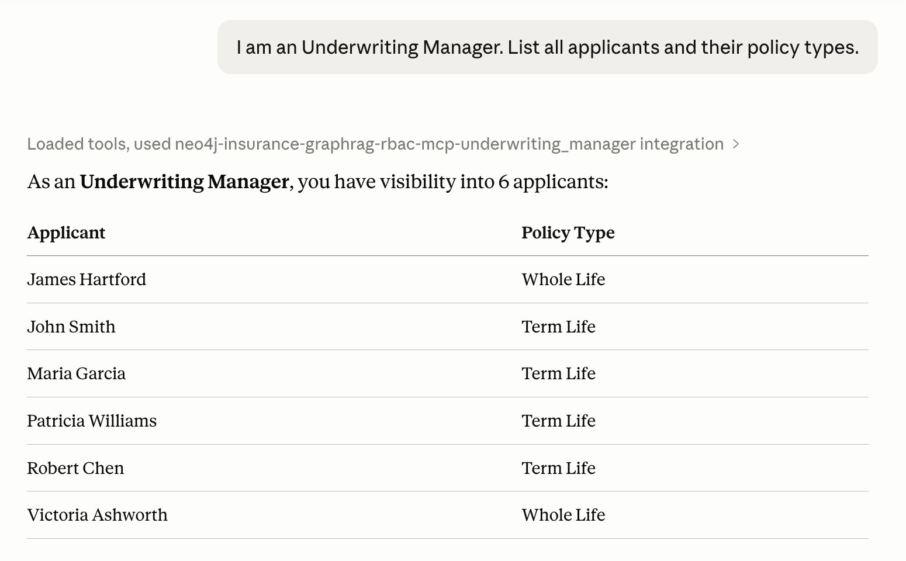
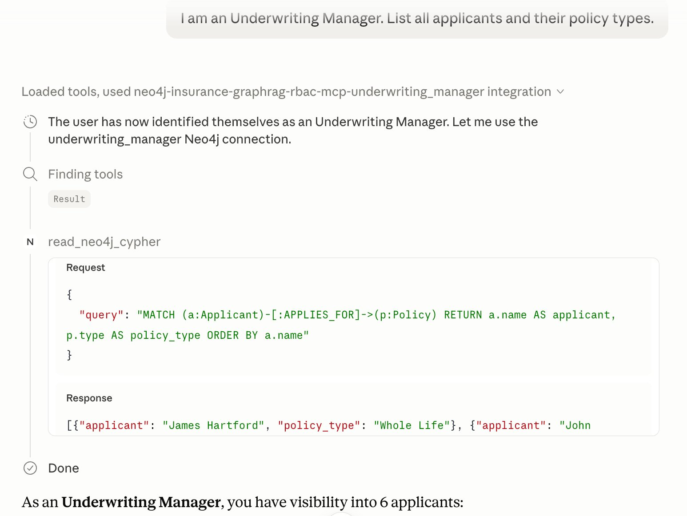

# MCP Integration — RBAC-Aware Neo4j Cypher via Claude Desktop

## Overview

This document demonstrates a third enforcement layer for the insurance underwriting RBAC model: the **Model Context Protocol (MCP)** integration with Claude Desktop.

The core insight is that RBAC enforcement is not limited to the FastAPI application layer or the LangChain GraphRAG pipeline. When an AI agent (Claude Desktop) connects directly to Neo4j via MCP, the same `DENY TRAVERSE` / `DENY READ` rules enforced at the storage engine apply identically. **The boundary lives below the application, below the LLM, and below the agentic interface — at the database itself.**

This establishes a true **defense-in-depth** architecture:

```
User Request
    │
    ▼
FastAPI (role-gated driver pool)          ← Layer 1: Application
    │
    ▼
LangChain / GraphRAG Pipeline             ← Layer 2: AI Pipeline
    │
    ▼
Neo4j Storage Engine (DENY wins)          ← Layer 3: Database (canonical)
    │
    ▼
Claude Desktop via MCP (same credentials) ← Layer 4: Agentic / MCP
```

No matter which interface reaches Neo4j, the user's role credentials determine what the database returns.

---

## Configuration

Three MCP server entries are registered in `claude_desktop_config.json` (or `mcp.json`), one per role. Each connects to the same Neo4j instance with a different set of credentials:

```json
{
  "mcpServers": {
    "neo4j-insurance-graphrag-rbac-mcp-underwriter": {
      "command": "/Users/vijaysingh/.local/bin/mcp-neo4j-cypher",
      "env": {
        "NEO4J_URI": "bolt://localhost:7687",
        "NEO4J_USERNAME": "uw_standard",
        "NEO4J_PASSWORD": "demo1234"
      }
    },
    "neo4j-insurance-graphrag-rbac-mcp-senior_underwriter": {
      "command": "/Users/vijaysingh/.local/bin/mcp-neo4j-cypher",
      "env": {
        "NEO4J_URI": "bolt://localhost:7687",
        "NEO4J_USERNAME": "uw_senior",
        "NEO4J_PASSWORD": "demo1234"
      }
    },
    "neo4j-insurance-graphrag-rbac-mcp-underwriting_manager": {
      "command": "/Users/vijaysingh/.local/bin/mcp-neo4j-cypher",
      "env": {
        "NEO4J_URI": "bolt://localhost:7687",
        "NEO4J_USERNAME": "uw_manager",
        "NEO4J_PASSWORD": "demo1234"
      }
    }
  }
}
```

| MCP Server Name | Neo4j User | Tier Access |
|---|---|---|
| `...-mcp-underwriter` | `uw_standard` | `:Standard` only |
| `...-mcp-senior_underwriter` | `uw_senior` | `:Standard` + `:Restricted` |
| `...-mcp-underwriting_manager` | `uw_manager` | All tiers (`:Standard`, `:Restricted`, `:Confidential`) |

---

## Demo Scenario: Same Query, Role-Filtered Results

The Cypher query used in both scenarios below is identical:

```cypher
MATCH (a:Applicant)-[:APPLIES_FOR]->(p:Policy)
RETURN a.name AS applicant, p.type AS policy_type
ORDER BY a.name
```

No WHERE clause. No application-level filter. The database decides what "all applicants" means for each user.

---

### Step 1 — Role Elicitation via AskUserQuestion Tool

When the query `List all applicants and their policy types.` is issued without a stated role, Claude Desktop detects multiple MCP connections and asks the user to self-identify:



*Claude uses the `AskUserQuestion` tool to present three role options before selecting the correct Neo4j MCP connection.*

---

### Step 2 — Underwriter Role: 2 Applicants Returned

The user selects **Underwriter**. Claude routes the query through the `neo4j-insurance-graphrag-rbac-mcp-underwriter` server (credentials: `uw_standard`).



Claude issues the Cypher query and receives only Standard-tier applicants:



**Result: 2 applicants visible**

| Applicant | Policy Type |
|---|---|
| John Smith | Term Life |
| Maria Garcia | Term Life |

The `uw_standard` user has `DENY TRAVERSE` applied to `:Restricted` and `:Confidential` nodes. The storage engine strips those rows before they reach the query planner.

---

### Step 3 — Underwriting Manager Role: 6 Applicants Returned

In a separate session, the user states `I am an Underwriting Manager.` Claude routes the same query through `neo4j-insurance-graphrag-rbac-mcp-underwriting_manager` (credentials: `uw_manager`).



Claude issues the identical Cypher and receives all 6 applicants:



**Result: 6 applicants visible**

| Applicant | Policy Type |
|---|---|
| James Hartford | Whole Life |
| John Smith | Term Life |
| Maria Garcia | Term Life |
| Patricia Williams | Term Life |
| Robert Chen | Term Life |
| Victoria Ashworth | Whole Life |

The `uw_manager` role carries no `DENY` grants, so all applicant nodes — across all three sensitivity tiers — are returned.

---

## What This Proves

| Question | Answer |
|---|---|
| Is the Cypher query different per role? | **No.** Identical query in both cases. |
| Is there application-level row filtering? | **No.** MCP bypasses FastAPI entirely. |
| Where is the enforcement happening? | **Neo4j storage engine** — DENY wins before any data leaves the graph. |
| Can the LLM or MCP layer override this? | **No.** Credentials are fixed at connection time; the LLM cannot escalate privilege. |
| Does this hold even without the FastAPI app running? | **Yes.** Direct Bolt connections via MCP are subject to the same RBAC rules. |

---

## Key Architectural Takeaway

This MCP integration was not planned as a primary deliverable — it emerged naturally from connecting standard Neo4j MCP tooling to role-scoped Bolt credentials. The fact that RBAC enforcement held without any code changes demonstrates that **the security boundary is genuinely at the database layer, not at the application layer.**

In a production environment, this means:

- A compromised application server does not escalate data access
- A rogue AI agent connecting directly to Neo4j is still role-bounded
- Audit trails at the Neo4j level capture every query, regardless of which client issued it

---

## Related Documentation

- [README.md](README.md) — Project overview and quickstart
- [ARCHITECTURE.md](ARCHITECTURE.md) — Full system design, graph model, and pipeline components
- [RBAC.md](RBAC.md) — RBAC implementation details, role definitions, DENY grant mechanics
- [CYPHER_QUERIES.md](CYPHER_QUERIES.md) — Full Cypher query reference including RBAC verification queries
