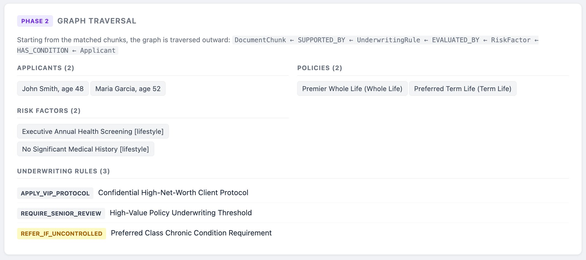
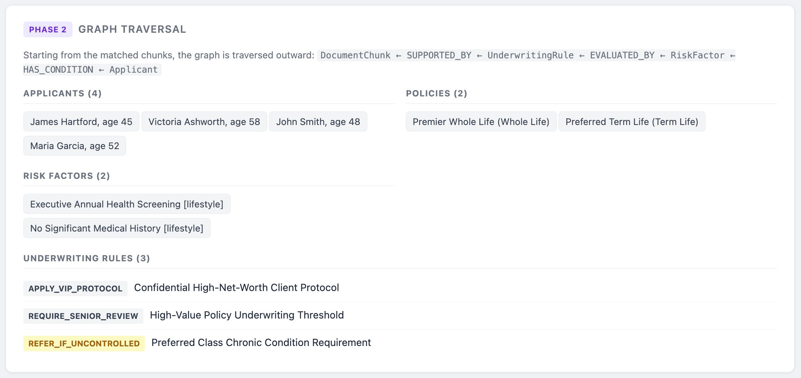
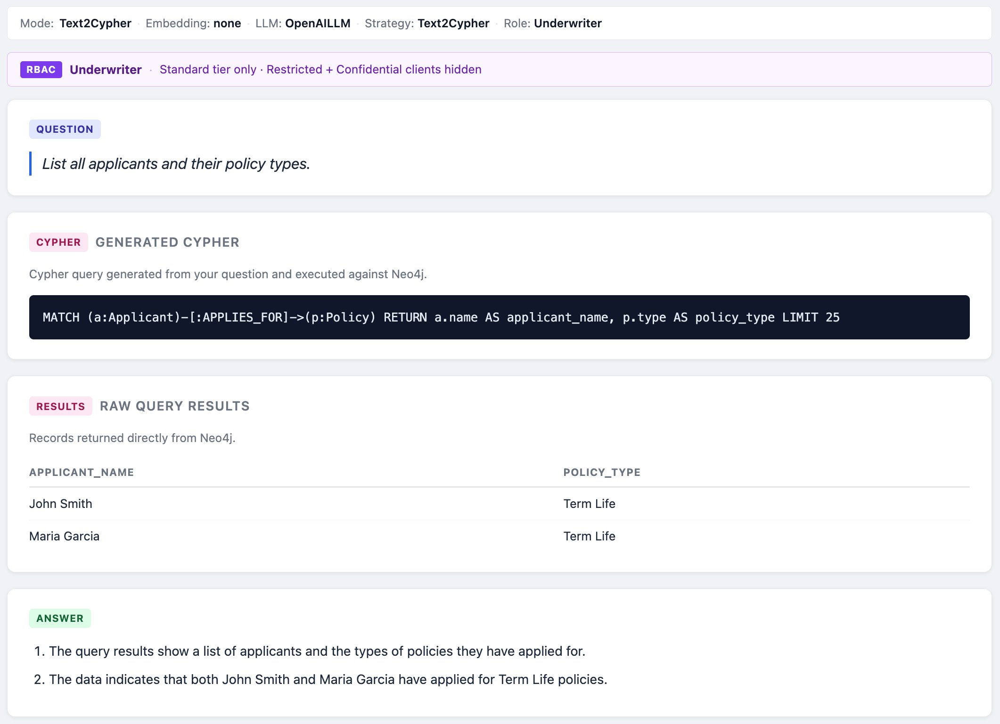
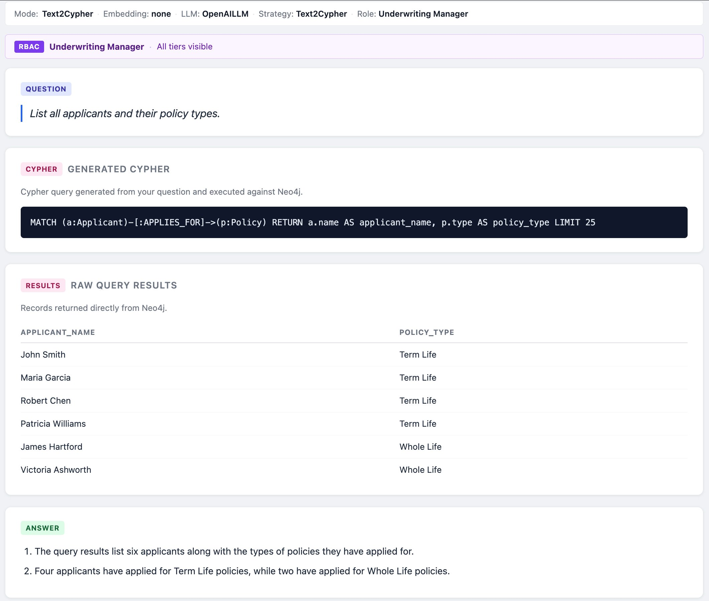

# Role-Based Access Control (RBAC)

This project demonstrates **native Neo4j role-based access control** layered onto a
GraphRAG pipeline. The same underwriting question, asked by three different roles,
returns three different result sets — and the access boundary is enforced by the
**database engine**, not the application code.

> **Headline:** A user's role determines which applicant records they can see.
> Restricted records are invisible at the storage layer — they never appear in any
> query, traversal, or LLM context, regardless of how the data is reached.

---

## Why this exists

The base project ([neo4j-insurance-graphrag](https://github.com/vijaynsingh/neo4j-insurance-graphrag))
runs four retrieval modes on Neo4j Community Edition. Insurance underwriting,
however, is a domain where **not every underwriter should see every applicant** —
high-net-worth and VIP cases are routinely restricted to senior staff for privacy
and compliance reasons.

Neo4j's fine-grained security (roles, privileges, sub-graph access control) is an
**Enterprise Edition** capability. Adding RBAC therefore meant moving from Community
to Enterprise — the same community-to-enterprise path many production deployments
follow once security and scale requirements appear. This repository runs on
**Neo4j 5 Enterprise** under the 30-day evaluation license.

---

## The three tiers

Every applicant carries a **sensitivity tier**, modeled as a second node label in
addition to `:Applicant`:

| Tier | Label | Example applicants | Meaning |
|---|---|---|---|
| Standard | `:Standard` | John Smith, Maria Garcia | Routine cases |
| Restricted | `:Restricted` | Robert Chen, Patricia Williams | Elevated / complex medical |
| Confidential | `:Confidential` | James Hartford, Victoria Ashworth | High-net-worth / VIP |

So an applicant node looks like `(:Applicant:Standard {…})`. The tier is also stored
as a `sensitivity` property for convenient display and filtering — but the **label**
is what access control is enforced on.

---

## The three roles

Access escalates by seniority. Each higher role sees everything the lower roles see,
plus its own tier:

| Role | Neo4j user | Sees tiers | Applicants visible |
|---|---|---|---|
| Underwriter | `uw_standard` | Standard | 2 |
| Senior Underwriter | `uw_senior` | Standard + Restricted | 4 |
| Underwriting Manager | `uw_manager` | Standard + Restricted + Confidential | 6 |

---

## How enforcement works

The mechanism is **label-based access control with DENY-wins semantics**.

Each role is first granted full read access to the entire graph — database access,
node visibility and properties (`MATCH {*}`), and relationship traversal and
properties. Then specific tier labels are **denied** for the roles that shouldn't see
them. The same grant block runs for all three roles:

```cypher
// For each role — full graph read:
GRANT ACCESS              ON DATABASE neo4j              TO <role>;
GRANT MATCH {*}           ON GRAPH neo4j NODES *         TO <role>;
GRANT TRAVERSE            ON GRAPH neo4j RELATIONSHIPS * TO <role>;
GRANT READ {*}            ON GRAPH neo4j RELATIONSHIPS * TO <role>;

// Then tier denials (DENY beats GRANT):
// underwriter — Standard only:
DENY TRAVERSE             ON GRAPH neo4j NODES Restricted   TO underwriter;
DENY READ {*}             ON GRAPH neo4j NODES Restricted   TO underwriter;
DENY TRAVERSE             ON GRAPH neo4j NODES Confidential  TO underwriter;
DENY READ {*}             ON GRAPH neo4j NODES Confidential  TO underwriter;

// senior_underwriter — Standard + Restricted:
DENY TRAVERSE             ON GRAPH neo4j NODES Confidential  TO senior_underwriter;
DENY READ {*}             ON GRAPH neo4j NODES Confidential  TO senior_underwriter;

// underwriting_manager — no denials, full visibility
```

`DENY TRAVERSE` makes a node invisible to `MATCH` patterns — the engine skips it as if
it does not exist. `DENY READ {*}` removes property access as a defense-in-depth second
layer. Both target the **tier label**, never the shared `:Applicant` label, so
non-applicant nodes are unaffected.

Neo4j evaluates **DENY before GRANT**, across every role a user holds (including the
built-in `PUBLIC` role). A node carrying a denied label is treated as if it does not
exist for that session: it never appears in `MATCH` results, and relationships that
would lead to it return no rows.

Crucially, the **non-applicant** nodes (Policy, RiskFactor, LabResult,
UnderwritingRule, DocumentChunk) carry none of the tier labels, so they remain fully
readable at every level. The tiering restricts **which applicants are visible**, not
the underwriting knowledge itself.

The setup is scripted and idempotent in [`app/rbac_setup.py`](app/rbac_setup.py):

```bash
python3 -m app.rbac_setup
```

---

## Verifying enforcement at the database layer

Connecting directly as each user proves the scoping before any application code is
involved:

```bash
# Underwriter — sees 2 (Standard only)
docker exec -it neo4j-insurance-graphrag-rbac cypher-shell -u uw_standard -p demo1234 \
  "MATCH (a:Applicant) RETURN a.name, a.sensitivity ORDER BY a.name;"

# Senior Underwriter — sees 4 (+ Restricted)
docker exec -it neo4j-insurance-graphrag-rbac cypher-shell -u uw_senior -p demo1234 \
  "MATCH (a:Applicant) RETURN a.name, a.sensitivity ORDER BY a.name;"

# Underwriting Manager — sees all 6
docker exec -it neo4j-insurance-graphrag-rbac cypher-shell -u uw_manager -p demo1234 \
  "MATCH (a:Applicant) RETURN a.name, a.sensitivity ORDER BY a.name;"
```

The enforcement even survives multi-hop traversal. Starting from `Policy` nodes and
walking *into* applicants, the underwriter still sees only the two standard-tier
applicants:

```bash
docker exec -it neo4j-insurance-graphrag-rbac cypher-shell -u uw_standard -p demo1234 \
  "MATCH (p:Policy)<-[:APPLIES_FOR]-(a:Applicant) RETURN p.name AS policy, a.name AS applicant ORDER BY a.name;"
```

This is the property that makes the whole approach work: because the GraphRAG
pipeline traverses `DocumentChunk → UnderwritingRule → RiskFactor → Applicant`, and
because enforcement holds across those hops, **the pipeline is scoped automatically
with zero changes to its retrieval logic.**

---

## In the application

The app connects to Neo4j **as the selected role's user**. A per-request role
selector (next to the retrieval-mode selector) maps to one of three pre-created,
pooled drivers:

```
underwriter          → uw_standard
senior_underwriter   → uw_senior
underwriting_manager → uw_manager
```

Both retrieval phases — the vector search and the graph traversal — execute on the
scoped connection, so denied applicants never enter the pipeline or the LLM context.
The active role is surfaced in the UI's RBAC bar so the access boundary is always
visible.

> **Production note.** For the demo, one Neo4j user per role keeps the security model
> visible and easy to reason about. In production you would typically keep a single
> pooled connection and use **impersonation** (`EXECUTE AS`) or map the role from an
> authenticated SSO session, rather than maintaining a connection per role.

---

## Demonstration 1 — GraphRAG traversal scoping (the VIP question)

Question: **"How are high-value VIP policies over $5 million underwritten?"**, asked
in OpenAI mode.

The matched document chunk is the *VIP Client Handling Protocol*, which states that
such records are restricted to senior underwriters and must not be shared with
standard underwriting staff. The graph traversal from that chunk reaches the two
**Confidential**-tier VIP applicants (James Hartford, Victoria Ashworth) — but only
for a role permitted to see them.

**As Underwriter** — the confidential VIP clients are absent. Only the two
standard-tier applicants appear:



**As Underwriting Manager** — the same question, now with James Hartford and
Victoria Ashworth visible:



The underwriting *knowledge* (the VIP protocol chunk and its rules) is readable by
both roles — it is policy guidance, not client data. Only the **client identities**
behind it are tier-protected.

---

## Demonstration 2 — Text2Cypher defense-in-depth (identical query, different results)

This is the stronger security point. In Text2Cypher mode the LLM generates a Cypher
query from natural language. Asked **"List all applicants and their policy types"**,
it produces the same unrestricted query for every role:

```cypher
MATCH (a:Applicant)-[:APPLIES_FOR]->(p:Policy)
RETURN a.name AS applicant_name, p.type AS policy_type LIMIT 25
```

**As Underwriter** — the generated query asks for *every* applicant, but the database
returns only two rows:



**As Underwriting Manager** — identical generated Cypher, six rows:



The security does **not** depend on the LLM writing a careful or filtered query. A
naive query, a clever query, even a deliberately unrestricted one all hit the same
wall: the access boundary lives **below the application and below the LLM**, at the
storage engine. The LLM asked for every applicant; the database decided what "every"
means for that user.

---

## Summary

| | GraphRAG traversal | Text2Cypher |
|---|---|---|
| How data is reached | Multi-hop graph traversal from a vector hit | Direct LLM-generated Cypher |
| What enforces access | Neo4j storage engine (`DENY TRAVERSE`) | Neo4j storage engine (`DENY TRAVERSE`) |
| Application changes needed | None | None |
| Result | Denied applicants never enter the pipeline | Denied applicants never returned, even for an unrestricted query |

Two different retrieval paths, one enforcement mechanism — applied once, at the
database, where it cannot be bypassed by the application layer above it.
