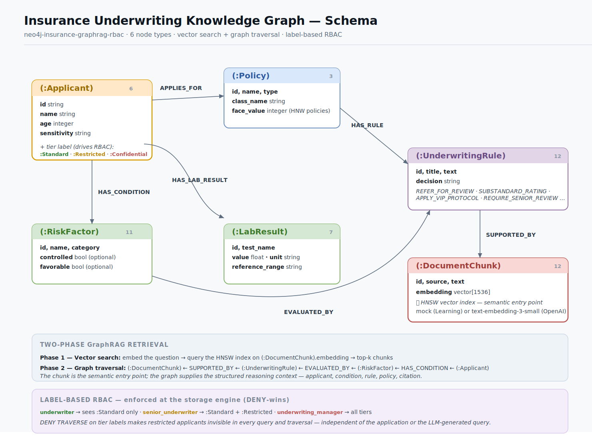
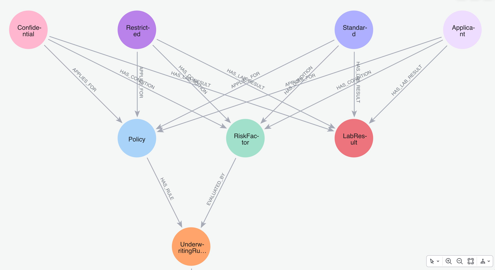
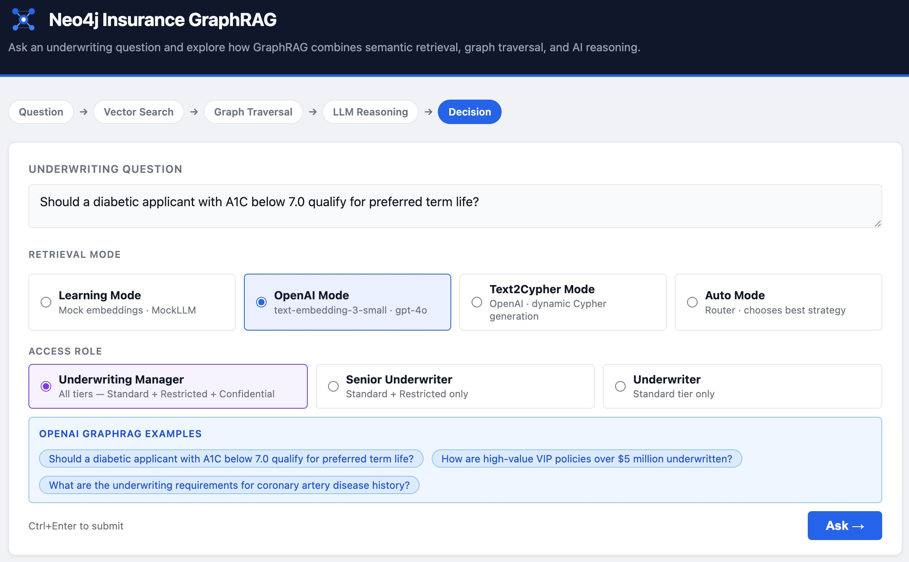
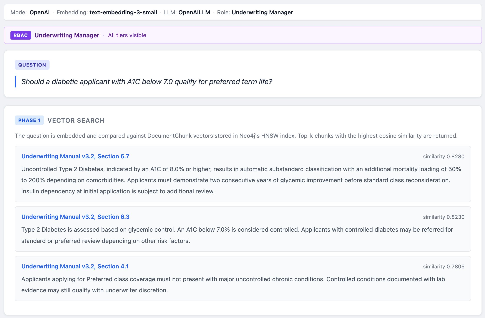
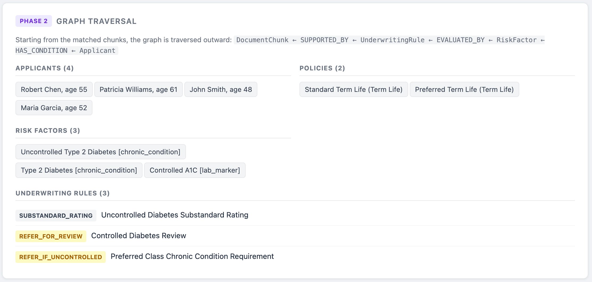
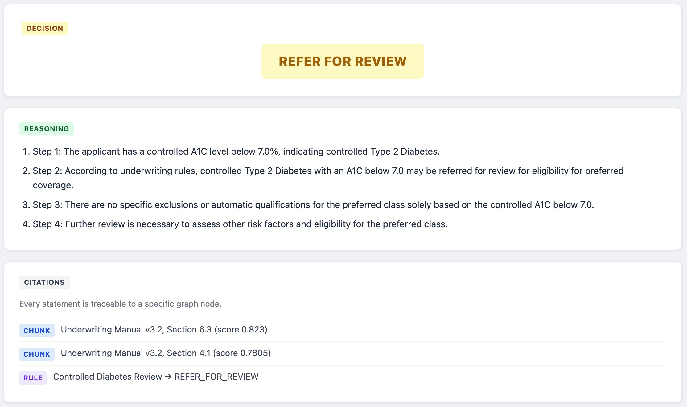
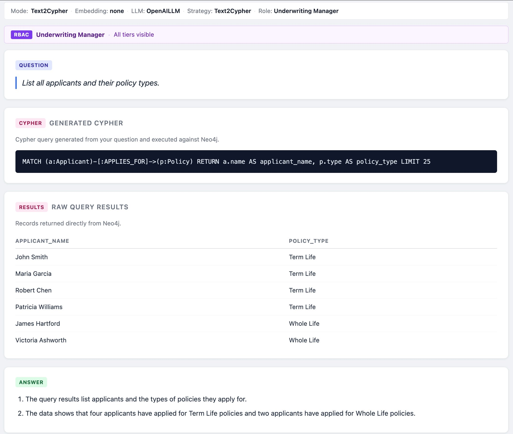
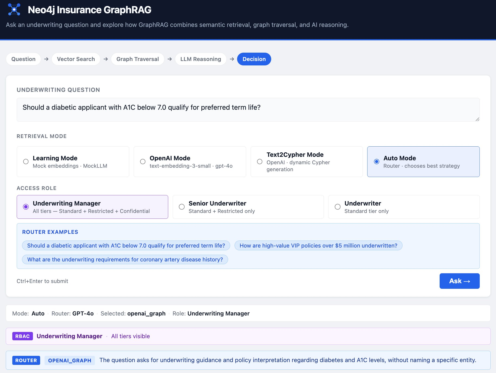
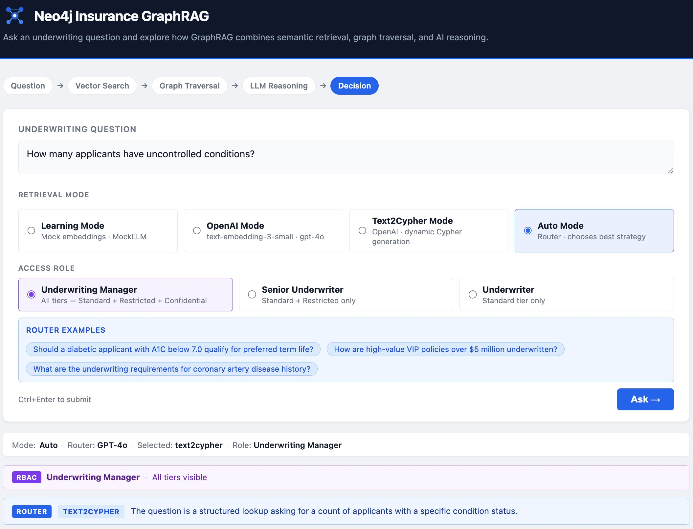
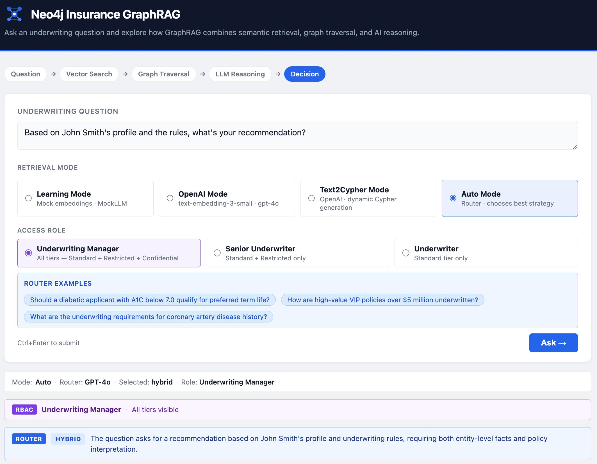

# Neo4j Insurance GraphRAG — with Role-Based Access Control

A reference implementation demonstrating Graph-augmented Retrieval (GraphRAG) for insurance
underwriting using Neo4j, vector search, and multiple retrieval strategies over a shared knowledge graph —
extended with **native Neo4j role-based access control** that scopes retrieval by data sensitivity tier.

**Stack:** Neo4j 5 **Enterprise** · Python 3.11 · FastAPI · OpenAI · Neo4j Vector Indexes · Native RBAC · Custom GraphRAG Pipeline

> **This repository extends [neo4j-insurance-graphrag](https://github.com/vijaynsingh/neo4j-insurance-graphrag).**
> The original runs four retrieval modes on Neo4j Community Edition. This version adds
> role-based access control on top — three underwriting roles see three different slices
> of the applicant data, enforced by the Neo4j engine itself. See **[RBAC.md](RBAC.md)** for the
> full access-control design, and the [edition note](#why-enterprise-edition) below for why
> this moved from Community to Enterprise.

> **Four modes, one graph — now role-secured.**
>
> This project demonstrates how multiple retrieval strategies can operate against the same Neo4j knowledge graph while sharing a common API contract and domain model — and how a single, database-enforced access-control layer scopes all of them at once.
>
> - **Learning Mode** — Mock embeddings and deterministic business logic. Runs completely offline with zero API cost.
> - **OpenAI Mode** — Uses `text-embedding-3-small` embeddings and `gpt-4o` reasoning while preserving the same graph model and response structure.
> - **Text2Cypher Mode** — GPT-4o generates read-only Cypher, Neo4j executes the query, and GPT-4o synthesizes a final answer. Best suited for structured entity lookups.
> - **Auto Mode** — GPT-4o classifies the question and selects the most appropriate retrieval strategy:
>
>   - `openai_graph` — vector search + graph traversal
>   - `text2cypher` — structured graph lookup
>   - `hybrid` — GraphRAG and Text2Cypher executed in parallel with answer synthesis
>
> The router's decision (`selected_strategy`) and explanation (`router_reason`) are returned in the API response for full transparency.
>
> - **Role-Based Access Control (all modes)** — three underwriting roles (Underwriter, Senior Underwriter, Underwriting Manager) see three different tiers of applicant data (Standard, Restricted, Confidential). Enforcement is native Neo4j RBAC at the storage layer, so it applies identically across all four retrieval modes with no per-mode logic. See **[RBAC.md](RBAC.md)**.

---

## What This Demonstrates

- GraphRAG retrieval: two-phase vector similarity search followed by structured graph traversal
- Text2Cypher retrieval: natural language to Cypher generation for structured graph lookups
- Auto routing: GPT-4o router selects the best retrieval strategy per question at runtime
- Hybrid retrieval: vector+graph and Text2Cypher run in parallel with synthesized results
- Explainable citations: every decision traces to specific graph nodes — rules, risk factors, manual sections
- Generated Cypher returned in the API response for full auditability of Text2Cypher queries
- Neo4j HNSW vector indexes for semantic similarity retrieval
- GPT-4o integration for embeddings, LLM reasoning, and router classification
- Automatic embedding re-indexing when switching between Learning Mode and OpenAI Mode
- Retrieval strategy selection: four modes selectable per request via the API or browser UI
- Modelling an insurance underwriting domain as a Neo4j knowledge graph
- How graph context (rules, risk factors, policies, applicants) enriches what the LLM receives
- How to expose a retrieval pipeline as a typed, error-handled REST API

---

## Key Concepts Demonstrated

- **Neo4j Knowledge Graph Modeling** — six node types with typed relationships encoding underwriting domain logic
- **Vector Indexes (HNSW)** — Hierarchical Navigable Small World index for approximate nearest-neighbour search over 1536-dimension embeddings
- **GraphRAG Architecture** — vector retrieval and graph traversal as complementary, not competing, retrieval strategies
- **Vector Retrieval + Graph Traversal** — two-phase pipeline: HNSW similarity search followed by Cypher relationship traversal in one round-trip
- **Explainable AI with Citations** — every decision links back to specific graph nodes: manual sections, rules, risk factors
- **FastAPI Service Layer** — typed request/response models, lifespan-managed resources, structured error handling
- **Provider Pattern (Learning Mode vs OpenAI Mode)** — strategy pattern so the pipeline never checks which provider is active; `for_mode()` classmethod handles wiring
- **Embedding Consistency Validation** — stored `embedding_model` metadata detected and auto-reindexed when the mode changes
- **Graph-Based Context Enrichment** — LLM receives structured entities and relationships, not raw text paragraphs
- **Text2Cypher Pattern** — GPT-4o translates natural language to read-only Cypher; result records become structured context for a final answer; guardrails prevent write operations
- **Router-Based Retrieval Orchestration** — GPT-4o zero-shot classification chooses `openai_graph`, `text2cypher`, or `hybrid` per question; router choice and reason returned in the response
- **Hybrid Retrieval** — both vector+graph and Text2Cypher retrievers run for entity-specific recommendation questions; GPT-4o synthesizes a single answer from both result sets

---

## Why GraphRAG?

Standard RAG retrieves text chunks — it cannot tell you *which* applicant has *which* condition, or *which* rules govern that condition for a specific policy. That relational context lives in the graph, not in any single passage.

This system uses a two-phase approach:

1. **Vector search** — embed the question and find the most semantically relevant `DocumentChunk` nodes via Neo4j's HNSW index.
2. **Graph traversal** — walk outward from those chunks through `SUPPORTED_BY → UnderwritingRule → EVALUATED_BY → RiskFactor → HAS_CONDITION → Applicant` to assemble the full reasoning chain in one Cypher round-trip.

The LLM receives **structured entities and relationships**, not raw text paragraphs. Every fact in the answer traces back to a specific graph path — that is the explainability that matters in regulated industries like insurance.

---

## Why Neo4j Instead of Vector-Only RAG?

A pure vector store returns the most similar text passages. That is useful, but in a domain like insurance underwriting, the decision depends on *relationships*, not just text similarity:

- **Vector search** retrieves the most relevant underwriting manual sections (`DocumentChunk` nodes).
- **Graph traversal** follows `SUPPORTED_BY` edges from those chunks to `UnderwritingRule` nodes — the structured decision logic.
- Rules connect via `EVALUATED_BY` to `RiskFactor` nodes — the specific medical or lifestyle conditions being assessed.
- Risk factors connect via `HAS_CONDITION` to the `Applicant` — the person the question is actually about.
- The policy scope is recovered via `HAS_RULE → Policy ← APPLIES_FOR` — ensuring only rules for the correct product are considered.

No single text chunk contains all of this. A vector store would require multiple lookups and manual joining in application code. Neo4j traverses the entire chain in one Cypher query.

**What this adds over vector-only RAG:**

| Property              | Vector-only RAG    | GraphRAG (this project)                             |
| --------------------- | ------------------ | --------------------------------------------------- |
| Retrieval unit        | Text chunk         | Graph path (chunk → rule → risk factor → applicant) |
| Entity awareness      | Inferred from text | Explicit node properties                            |
| Scope                 | All similar text   | Only rules for the relevant policy                  |
| Multi-hop reasoning   | Not supported      | Native — any depth via Cypher                       |
| Citations             | Source document    | Specific rule, risk factor, and manual section      |
| Explainability        | "The manual says…" | Traceable graph path per decision                   |

In regulated industries, the ability to reproduce *exactly* what the system saw — and which rule triggered which decision — is not a nice-to-have. Neo4j makes that auditability structural rather than bolted on.

---

## Why Enterprise Edition

The base project runs on Neo4j Community Edition. Adding role-based access control
required moving to **Neo4j 5 Enterprise**, because fine-grained security — roles,
privileges, and sub-graph access control — is an Enterprise capability. Community
Edition has no `CREATE ROLE`, no `GRANT`/`DENY` on graph elements, and a single user.

This is the same community-to-enterprise path many real deployments follow: start on
Community to model the domain and prove the pipeline, then graduate to Enterprise once
security, access control, or clustering requirements appear. This repository runs on
the **30-day Enterprise evaluation license** (`NEO4J_ACCEPT_LICENSE_AGREEMENT=eval`).

---

## Role-Based Access Control

Insurance underwriting is a domain where not every underwriter should see every
applicant — high-net-worth and VIP cases are routinely restricted to senior staff.
This project models that with three sensitivity tiers and three roles:

| Role | Neo4j user | Sees tiers | Applicants visible |
|---|---|---|---|
| Underwriter | `uw_standard` | Standard | 2 |
| Senior Underwriter | `uw_senior` | Standard + Restricted | 4 |
| Underwriting Manager | `uw_manager` | Standard + Restricted + Confidential | 6 |

Each applicant carries a tier as a **second node label** (`:Applicant:Confidential`),
and roles are `DENY TRAVERSE`-d from the tiers above their clearance. Because Neo4j
enforces this at the **storage layer**, the same access boundary applies to every
retrieval mode — GraphRAG traversal and Text2Cypher alike — with no changes to the
pipeline logic. A restricted applicant simply never appears in any result, traversal,
or LLM context for a role that lacks clearance.

The application exposes a per-request **role selector** alongside the mode selector;
the same question asked by different roles returns different scoped results, live.

**See [RBAC.md](RBAC.md) for the full design**, including the grant/deny model, the
database-layer verification, and the two demonstrations (VIP-question traversal
scoping, and Text2Cypher defense-in-depth where an identical generated query returns
different rows per role).

---

## Architecture

```text
POST /ask  {"question": "...", "mode": "demo"|"openai"|"text2cypher"|"auto", "role"?: "underwriter"|"senior_underwriter"|"underwriting_manager"}
      │
      ▼
FastAPI  app/main.py
      │  (lifespan: 1 admin + 3 per-role RBAC drivers, pipelines for available modes, asyncio.Lock)
      │
      ├── Auto-reindex (if stored embedding model ≠ requested mode's provider)
      │     reindex_embeddings(driver, provider)  ← vectors only, graph unchanged
      │     asyncio.Lock prevents concurrent double-reseed
      │
      ├─── mode: "demo" | "openai"
      │     ▼
      │   GraphRAGPipeline  app/graphrag_pipeline.py
      │     (Learning Mode → MockEmbeddingProvider + MockLLM
      │      OpenAI Mode   → OpenAIEmbeddingProvider + OpenAILLM)
      │     ├── Phase 1 — Vector search
      │     │     provider.embed(question) → db.index.vector.queryNodes()
      │     │     → top-k DocumentChunk nodes + similarity scores
      │     └── Phase 2 — Graph traversal
      │           UNWIND chunk_ids → MATCH rules, risk_factors, policies, applicants
      │           → llm.generate_answer() → {decision, reasoning, citations}
      │
      ├─── mode: "text2cypher"
      │     ▼
      │   Text2CypherService  app/text2cypher_service.py
      │     GPT-4o generates read-only Cypher from question + schema
      │     → Neo4j executes query → raw records
      │     → GPT-4o synthesizes final answer from records
      │     → {generated_cypher, raw_query_results, reasoning}
      │
      └─── mode: "auto"
            ▼
          RetrievalRouter  app/retrieval_router.py
            GPT-4o classifies question → openai_graph | text2cypher | hybrid
            → routes to GraphRAGPipeline, Text2CypherService, or both
            → {selected_strategy, router_reason, …combined fields…}
```

This implementation supports multiple retrieval strategies operating against a shared Neo4j knowledge graph:

- **Learning Mode and OpenAI Mode** use the two-phase GraphRAG pipeline: vector similarity search followed by graph traversal.
- **Text2Cypher Mode** uses GPT-4o to generate read-only Cypher queries and synthesize answers from Neo4j query results.
- **Auto Mode** routes each question to the most appropriate retrieval strategy.
- **Hybrid retrieval** executes GraphRAG and Text2Cypher in parallel and synthesizes a single answer.

Retrieval strategy should match question type:

- Semantic policy and underwriting questions benefit from GraphRAG.
- Structured entity lookups benefit from Text2Cypher.
- Recommendation-style questions that require both entity facts and policy interpretation often benefit from Hybrid retrieval.

---

## Graph Model

```text
(Applicant) -[:APPLIES_FOR]→    (Policy)
(Applicant) -[:HAS_CONDITION]→  (RiskFactor)
(Applicant) -[:HAS_LAB_RESULT]→ (LabResult)
(Policy)    -[:HAS_RULE]→       (UnderwritingRule)
(RiskFactor)-[:EVALUATED_BY]→   (UnderwritingRule)
(UnderwritingRule)-[:SUPPORTED_BY]→ (DocumentChunk)  ← embeddings live here
```

Each `Applicant` also carries a **sensitivity tier as a second label** —
`:Standard`, `:Restricted`, or `:Confidential` — which is the boundary that
role-based access control is enforced on (see [RBAC.md](RBAC.md)).

DocumentChunk nodes carry vector embeddings. UnderwritingRule nodes carry structured
decision logic. The graph connects them: vector search finds the chunk, traversal finds
the rule, rule links to the risk factor and applicant. No single text chunk contains all of this.



The seed data contains **6 applicants** (2 per tier), 3 policies, 11 risk factors,
7 lab results, 12 underwriting rules, and 12 document chunks.

---

## Modes

Mode is selected **per request** via the `mode` field in the API (or the browser UI).
The server initializes all available pipelines and services at startup based on configuration.

### Learning Mode (default — no API key needed)

Mock embeddings (SHA-256 hash) + MockLLM (deterministic business logic). Free, offline, instant.

Pass `"mode": "demo"` in the request body.

### OpenAI Mode (requires `OPENAI_API_KEY`)

Real semantic embeddings (`text-embedding-3-small`) + `gpt-4o` reasoning over graph context.

```bash
# .env — only this is needed
OPENAI_API_KEY=sk-...
```

Pass `"mode": "openai"` in the request body.

> **Auto-reindex:** Switching modes re-embeds all `DocumentChunk` nodes automatically on
> the first request in that mode — no manual `python3 -m app.seed` required.
> Only the embedding vectors are updated; the graph structure is unchanged.
> The first request after a mode switch takes a few extra seconds while re-indexing runs.

### Text2Cypher Mode (requires `OPENAI_API_KEY`)

Natural language → GPT-4o generates Cypher → executed against Neo4j → GPT-4o synthesizes answer.
No vector embeddings or graph traversal. Suited for structured lookups: lists, counts, filters.

Pass `"mode": "text2cypher"` in the request body.

### Auto Mode (requires `OPENAI_API_KEY`)

GPT-4o classifies the question and routes it to the best retrieval strategy:

| Router decision | Strategy used                                                             |
|-----------------|---------------------------------------------------------------------------|
| `openai_graph`  | Vector search + graph traversal + GPT-4o (semantic / policy questions)    |
| `text2cypher`   | NL -> Cypher -> graph records -> GPT-4o (structured entity lookups)       |
| `hybrid`        | Both strategies run in parallel; GPT-4o synthesizes a single final answer |

Hybrid is selected when a question names a specific entity *and* asks for a recommendation
or explanation that also requires policy/manual interpretation.

The response includes `selected_strategy` (what the router chose) and `router_reason`
(a one-sentence explanation). For text2cypher and hybrid responses, `generated_cypher` and `raw_query_results` are included.

For hybrid responses, these appear alongside the full GraphRAG graph context.

Pass `"mode": "auto"` in the request body.

> **Production note:** The router uses GPT-4o zero-shot classification. For production use,
> validate routing accuracy against a golden dataset of labelled questions before relying
> on it for high-stakes decisions.

---

## Screenshots

### Knowledge Graph Model



Neo4j graph model representing applicants (with sensitivity-tier labels), policies, risk factors, underwriting rules, and document chunks.

---

### Application Home Page



Unified interface with a retrieval-mode selector (Learning · OpenAI · Text2Cypher · Auto) and an access-role selector (Underwriter · Senior Underwriter · Underwriting Manager).

---

### GraphRAG Retrieval — Phase 1 (Vector Search)



Vector similarity search retrieves the most relevant document chunks from Neo4j's HNSW index.

---

### GraphRAG Retrieval — Phase 2 (Graph Traversal)



Traversal expands outward from the matched chunks to assemble applicants, policies, risk factors, and rules.

---

### GraphRAG Decision and Citations



Decision, reasoning, and explainable citations — every statement traces to a specific graph node.

---

### Text2Cypher Retrieval



Natural language is translated into Cypher, executed against Neo4j, and synthesized into an answer.

---

### Auto Router — GraphRAG / Text2Cypher / Hybrid



Router selects `openai_graph` for semantic and policy-interpretation questions.



Router selects `text2cypher` for structured lookup questions.



Router selects `hybrid` when a question needs both structured graph facts and semantic reasoning.

---

### Role-Based Access Control

The same VIP question, asked by two different roles. **As Underwriter**, the confidential high-net-worth applicants are hidden:


**As Underwriting Manager**, the same question now surfaces James Hartford and Victoria Ashworth:


Defense-in-depth: in Text2Cypher mode the LLM generates an *identical* unrestricted query for both roles, yet the database returns 2 rows for the Underwriter and 6 for the Manager — the engine enforces access, not the query.


See **[RBAC.md](RBAC.md)** for the full walkthrough.

---

## How to Run

```bash
docker compose up -d           # starts Neo4j 5 Enterprise (evaluation license)
pip install -r requirements.txt
python3 -m app.seed            # initial graph setup only — run once
python3 -m app.rbac_setup      # create RBAC roles, users, and grants — run once
uvicorn app.main:app --port 8765 --reload
```

Then open <http://127.0.0.1:8765> in your browser for the interactive GraphRAG application.

`python3 -m app.seed` populates the graph (6 applicants across 3 sensitivity tiers).
`python3 -m app.rbac_setup` creates the three roles and demo users (`uw_standard` /
`uw_senior` / `uw_manager`, password `demo1234`); it is idempotent and safe to re-run.
Switching between Learning Mode and OpenAI Mode in the UI re-indexes embeddings
automatically — no manual re-seed required.

API docs (Swagger): <http://127.0.0.1:8765/docs>

> Ports 8000 and 8001 conflict with Docker on some machines — use 8765 or any free port.

---

## User Interface Layer

The root URL (`/`) serves a single-page application that visualises every pipeline step:

| Section | What it shows |
| ------- | ------------- |
| Mode selector | Four mode cards: Learning Mode · OpenAI Mode · Text2Cypher Mode · Auto Mode |
| Role selector | Three access-role cards: Underwriter · Senior Underwriter · Underwriting Manager — scopes which applicant tiers are visible |
| RBAC context bar (purple) | Active role and the tiers it can see (e.g. "Underwriter · Standard tier only · Restricted + Confidential clients hidden") |
| Example question strips | Per-mode clickable pill buttons that fill the textarea — hidden for inactive modes |
| Provider bar | Active mode, embedding model, and LLM; for Auto Mode shows Router and Selected strategy |
| Router reason callout (blue, Auto Mode only) | Strategy badge + one-sentence explanation of the routing decision |
| Auto-reindex notice (green) | Appears once when embeddings were automatically re-indexed for the selected mode |
| Embedding mismatch warning (amber) | Appears only if auto-reindex failed (e.g. network error during OpenAI call) |
| Generated Cypher (Text2Cypher / hybrid) | Cypher query generated from the question and executed against Neo4j |
| Raw Query Results (Text2Cypher / hybrid) | Records returned directly from Neo4j as a table |
| Phase 1 — Vector Search (GraphRAG / hybrid) | Matched DocumentChunk nodes with source and similarity score |
| Phase 2 — Graph Traversal (GraphRAG / hybrid) | Applicant, policies, risk factors, underwriting rules pulled from the graph |
| Final Decision (GraphRAG / hybrid) | Colour-coded badge (APPROVE / REFER\_FOR\_REVIEW / REQUIRE\_ADDITIONAL\_REVIEW / DECLINE) |
| Reasoning / Answer | Numbered explanation from the LLM; labelled "Answer" in Text2Cypher mode |
| Citations (GraphRAG / hybrid) | Each DocumentChunk source and UnderwritingRule that supported the decision |

No React. No build step. Plain HTML + CSS + JavaScript served by FastAPI.

---

## Sample Request (curl)

```bash
# Learning Mode (default — no API key required)
curl -X POST http://127.0.0.1:8765/ask \
  -H "Content-Type: application/json" \
  -d '{"question":"Should a diabetic applicant with A1C below 7.0 qualify for preferred term life?","mode":"demo"}'

# OpenAI Mode (requires OPENAI_API_KEY in .env)
curl -X POST http://127.0.0.1:8765/ask \
  -H "Content-Type: application/json" \
  -d '{"question":"Should a diabetic applicant with A1C below 7.0 qualify for preferred term life?","mode":"openai"}'

# Text2Cypher Mode — structured graph lookup (requires OPENAI_API_KEY)
curl -X POST http://127.0.0.1:8765/ask \
  -H "Content-Type: application/json" \
  -d '{"question":"Which underwriting rules apply to John Smith?","mode":"text2cypher"}'

# Auto Mode — router selects strategy (requires OPENAI_API_KEY)
curl -X POST http://127.0.0.1:8765/ask \
  -H "Content-Type: application/json" \
  -d '{"question":"Based on John Smith'\''s profile and underwriting rules, what is your recommendation?","mode":"auto"}'

# Role-scoped — the same question as an Underwriter (sees Standard tier only)
curl -X POST http://127.0.0.1:8765/ask \
  -H "Content-Type: application/json" \
  -d '{"question":"How are high-value VIP policies over $5 million underwritten?","mode":"openai","role":"underwriter"}'
```

The optional `role` field accepts `underwriter`, `senior_underwriter`, or
`underwriting_manager`. When omitted it defaults to `underwriting_manager` (full
access), preserving the original API contract. The response echoes the active `role`
and resolved `rbac_user`. See [RBAC.md](RBAC.md).

**Response:**

```json
{
  "question": "Should a diabetic applicant with A1C below 7.0 qualify for preferred term life?",
  "decision": "REFER_FOR_REVIEW",
  "reasoning": [
    "Type 2 Diabetes is present in the applicant's risk profile — a chronic condition that triggers mandatory underwriting review.",
    "A1C is controlled (below 7.0 threshold) — the condition is actively managed, which favourably adjusts the severity assessment.",
    "Preferred class requires underwriting review for any chronic condition, even when controlled.",
    "No tobacco use is recorded, which provides a favourable lifestyle adjustment to the overall risk profile."
  ],
  "supporting_rules": [
    {"id": "rule_002", "title": "Controlled Diabetes Review",        "decision": "REFER_FOR_REVIEW"},
    {"id": "rule_003", "title": "Tobacco Use Classification",        "decision": "APPROVE_FACTOR"}
  ],
  "risk_factors": [
    {"name": "Type 2 Diabetes", "category": "chronic_condition"},
    {"name": "Controlled A1C",  "category": "lab_marker"},
    {"name": "No Tobacco Use",  "category": "lifestyle"}
  ],
  "citations": [
    {"type": "DocumentChunk",    "source": "Underwriting Manual v3.2, Section 6.3", "relevance_score": 0.823},
    {"type": "DocumentChunk",    "source": "Underwriting Manual v3.2, Section 4.1", "relevance_score": 0.781},
    {"type": "UnderwritingRule", "title": "Controlled Diabetes Review",              "decision": "REFER_FOR_REVIEW"}
  ],
  "retrieval_summary": {
    "matched_chunks": 3,
    "rules": 3,
    "risk_factors": 3,
    "policies": 2,
    "applicants": 4
  },
  "mode": "openai",
  "embedding_provider": "text-embedding-3-small",
  "llm_provider": "OpenAILLM",
  "role": "underwriting_manager",
  "rbac_user": "uw_manager",
  "compatibility_warning": null,
  "reindexed": false
}
```

> The `applicants` count reflects role scoping: the same question as an `underwriter`
> would return fewer applicants, because restricted and confidential tiers are filtered
> at the database. The generated query is unchanged — only the visible results differ.

---

## Run Without the API

```bash
python3 -m app.graphrag_pipeline
```

---

## Endpoints

| Method | Path     | Description                              |
| ------ | -------- | ---------------------------------------- |
| GET    | /health  | Liveness check                           |
| POST   | /ask     | Submit a question, get a GraphRAG answer |

Interactive docs (Swagger UI): `http://127.0.0.1:8765/docs`

**Error codes:**

| Code | Cause                              |
|------|------------------------------------|
| 400  | `question` field is blank          |
| 503  | Neo4j is unreachable               |
| 500  | Unexpected server error            |

---

## Components by Mode

| Component | Learning Mode | OpenAI Mode | Text2Cypher Mode | Auto Mode |
| --- | --- | --- | --- | --- |
| Embeddings | SHA-256 hash (not semantic) | `text-embedding-3-small` | None | `text-embedding-3-small` (if routed to graph) |
| LLM | Deterministic Python logic | `gpt-4o` | `gpt-4o` | `gpt-4o` (router + answer) |
| Retrieval | Vector search + graph | Vector search + graph | NL → Cypher → graph records | Router-selected: graph / cypher / hybrid |
| Graph traversal | Yes | Yes | No (direct Cypher execution) | Depends on selected strategy |
| API key needed | No | Yes | Yes | Yes |
| Cost | Zero | OpenAI API charges apply | OpenAI API charges apply | OpenAI API charges apply |

Switch modes using the selector in the browser UI or the `mode` field in the API request.
Embeddings are re-indexed automatically on the first request in a new mode.
The graph model, traversal queries, and API contract are identical across all modes.

---

## Production Deployment Considerations

1. **OpenAI mode is already implemented** — set `OPENAI_API_KEY` in `.env` and select
   OpenAI Mode in the browser. Embeddings re-index automatically on the first request.
   The graph model and API contract are unchanged.
2. **Scale** — the schema supports any number of applicants, policies, and rules. Retrieval
   performance scales logarithmically with data volume through Neo4j's HNSW index (O(log n) rather than O(n) linear scan).
3. **Auth + observability** — add `Depends()` middleware for API key or JWT auth. Log
   `retrieval_summary` counts to detect retrieval quality drift over time.
4. **RBAC in production** — this demo connects as one Neo4j user per role for clarity.
   In production, keep a single pooled connection and use **impersonation** (`EXECUTE AS`),
   or map the role from an authenticated SSO/JWT session, rather than a connection per role.
   The access boundary itself (label-based `DENY TRAVERSE`) is unchanged. See [RBAC.md](RBAC.md).
5. **Additional LLM providers** — add any new LLM class following the same interface as
   `MockLLM` and `OpenAILLM`. No pipeline changes required.

---

## Topics Explored

Technical patterns implemented in this reference:

- **Knowledge Graph Modeling** — designing a property graph schema for a relationship-heavy domain; choosing which facts belong on nodes vs. relationships
- **Cypher Graph Traversal** — multi-hop `MATCH` and `OPTIONAL MATCH` queries; batching via `UNWIND` to minimise round-trips
- **Neo4j HNSW Vector Indexes** — creating and querying an HNSW approximate nearest-neighbour index; understanding what similarity scores mean in practice
- **GraphRAG Architecture** — combining vector retrieval and graph traversal so each phase handles what it does best
- **Vector Retrieval** — embedding text, storing vectors as node properties, querying via `db.index.vector.queryNodes()`
- **Graph-Based Context Enrichment** — traversing from retrieved chunks to connected rules, risk factors, applicants, and policies in one query
- **Explainable AI** — building citations that trace every decision back to a specific graph node rather than a raw text passage
- **OpenAI Embeddings (`text-embedding-3-small`)** — calling the embeddings API, storing results in Neo4j, and handling model/vector consistency across requests
- **LLM Grounding and Citations** — using `gpt-4o` with JSON mode over structured graph context; normalising response shapes across providers
- **FastAPI Service Design** — lifespan-managed resources, typed Pydantic models, async request handling with `asyncio.to_thread()`
- **Provider Abstraction Pattern** — strategy pattern so the pipeline is provider-agnostic; `for_mode()` classmethod handles all wiring
- **Embedding Consistency Validation** — detecting stored vs. active embedding model mismatches and auto-reindexing before the query runs
- **Text2Cypher Pattern** — NL-to-Cypher generation with schema grounding; read-only execution guardrails; structured graph lookups without vector search
- **Router-Based Retrieval Orchestration** — GPT-4o zero-shot routing; strategy selection at query time; transparent `selected_strategy` and `router_reason` in every response
- **Hybrid Retrieval** — running both retrievers in parallel and synthesizing a single answer from combined graph and Cypher context

---

## Project Structure

```text
static/
  index.html              — single-page application UI
  styles.css              — no external CDN dependencies
  app.js                  — fetch /ask, render each pipeline section
  favicon.svg             — browser favicon and header icon
app/
  config.py               — Neo4j connection settings (dotenv)
  graph.py                — driver factory + run_query helper
  embed.py                — MockEmbeddingProvider (SHA-256) and OpenAIEmbeddingProvider (text-embedding-3-small)
  seed.py                 — constraints, seed nodes/relationships (6 applicants + tier labels), attach embeddings; reindex_embeddings() for auto mode switching
  rbac_setup.py           — create RBAC roles, users, and label-based grants/denies (idempotent)
  vector_index.py         — create/verify HNSW vector index, similarity_search()
  graph_retriever.py      — GraphRetriever: two-phase vector + graph retrieval
  mock_llm.py             — MockLLM: deterministic underwriting decision logic
  openai_llm.py           — OpenAILLM: GPT-4o reasoning with structured JSON responses
  graphrag_pipeline.py    — GraphRAGPipeline: retriever → LLM → structured answer; run_with_driver() for role-scoped execution
  text2cypher_service.py  — Text2CypherService: NL → GPT-4o → Cypher → Neo4j → GPT-4o answer; run_with_driver() for role-scoped execution
  retrieval_router.py     — RetrievalRouter: GPT-4o classifies question, routes to openai_graph / text2cypher / hybrid
  main.py                 — FastAPI app: POST /ask (with role), GET /health; pre-creates per-role driver pool
data/
  underwriting_sample.json  — seed data source of truth (all nodes + relationships)
docs/
  images/
    01-home.png
    02-graphrag-phase1-vector.png
    03-graphrag-phase2-traversal.png
    04-graphrag-decision-citations.png
    05-text2cypher-setup.png
    06-text2cypher-result.png
    07-auto-router-graphrag.png
    08-auto-router-text2cypher.png
    09-auto-router-hybrid.png
    10-schema-visualization.png
    11-graph-applicant-detail.png
    12-19 rbac-*.png         (VIP + Text2Cypher contrast pairs, per role)
    neo4j-insurance-graph_model_schema.png
docker-compose.yml          — Neo4j 5 Enterprise service (eval license) with APOC plugin
requirements.txt            — Python dependencies
README.md                   — project overview, architecture summary, setup instructions, screenshots, and usage guide
ARCHITECTURE.md             — detailed design and implementation architecture
RBAC.md                     — role-based access control design, enforcement, and demonstrations
CYPHER_QUERIES.md           — Cypher reference queries for GraphRAG, Text2Cypher, and RBAC validation
```
