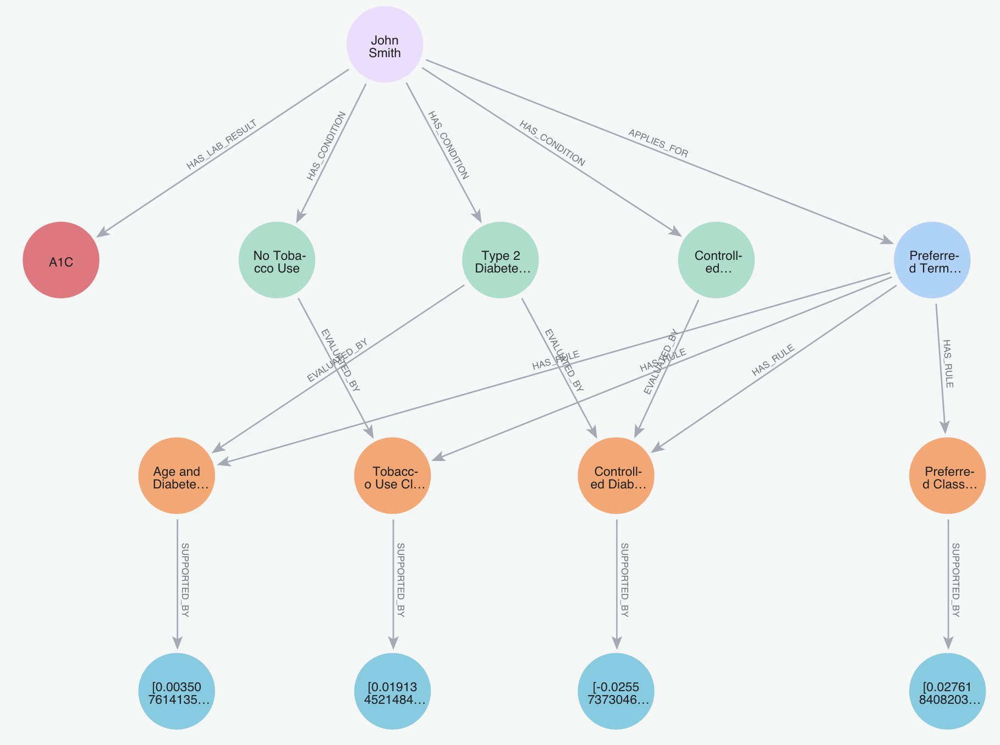
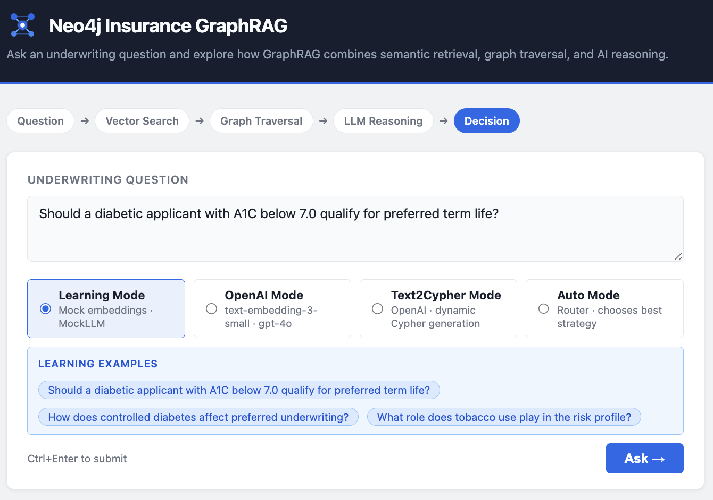
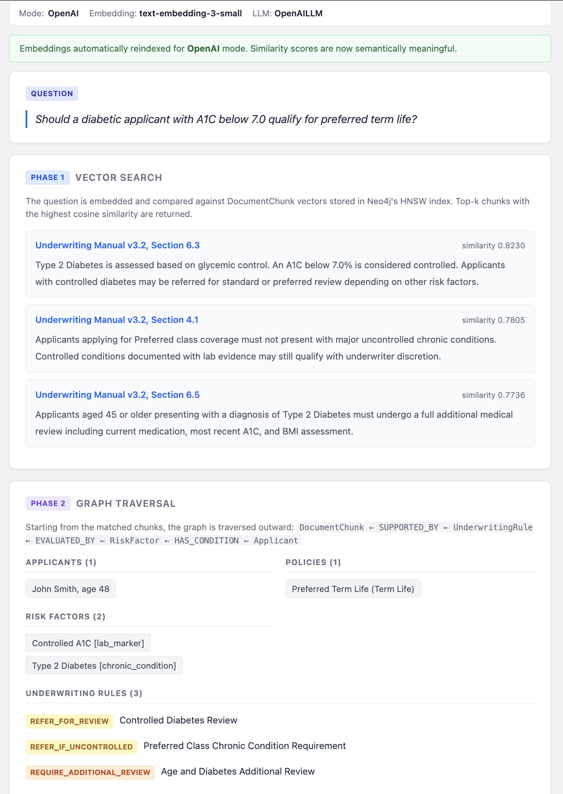
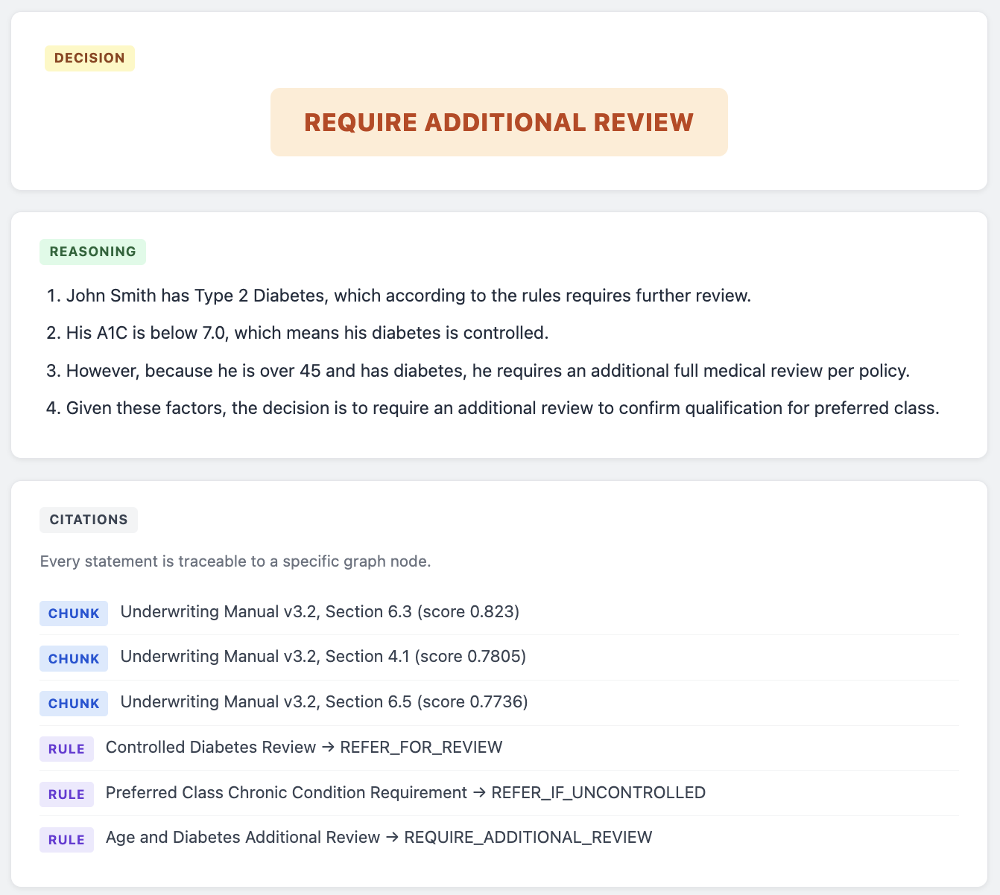
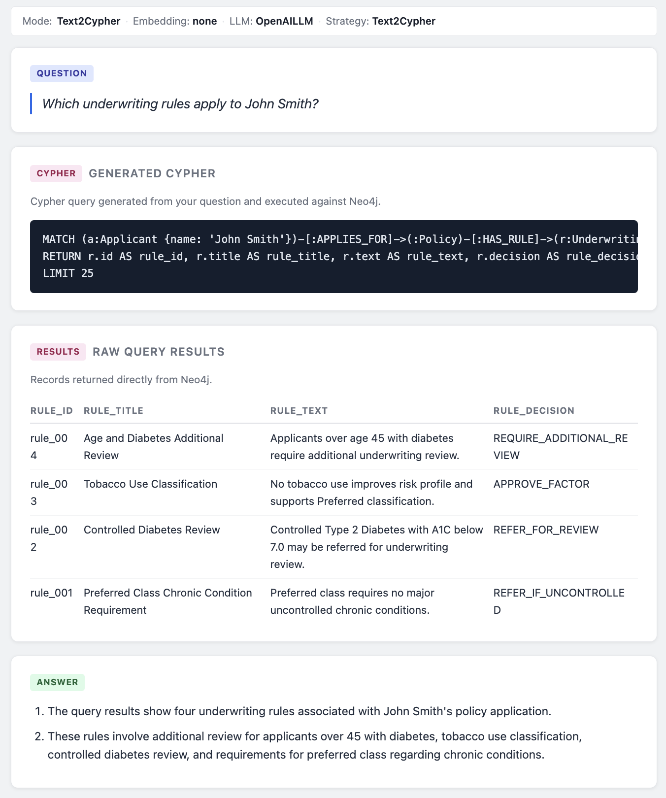
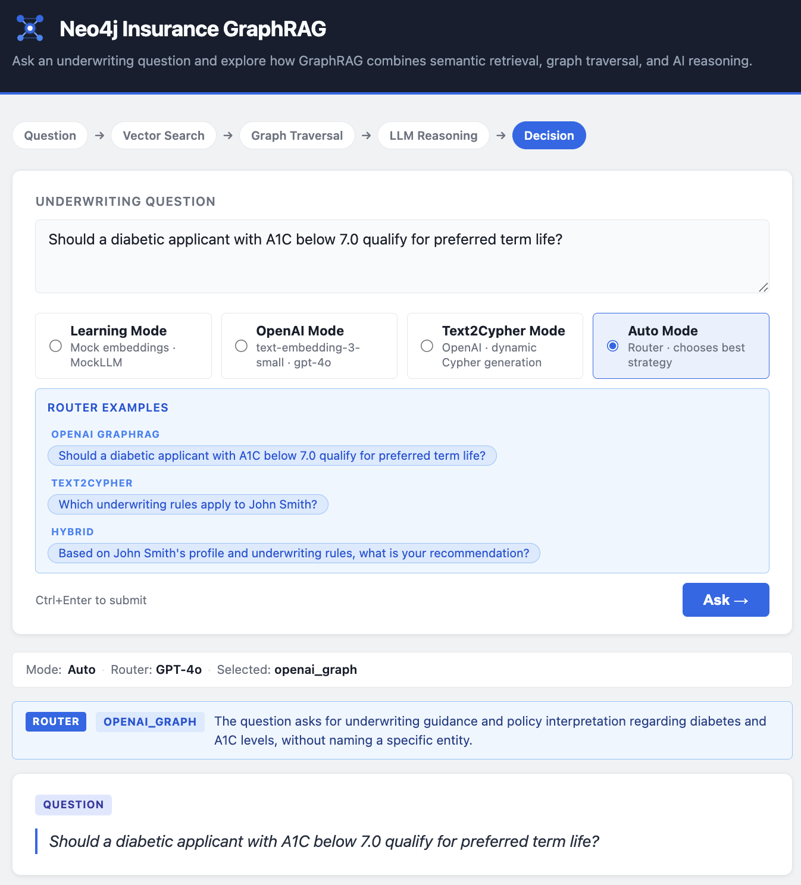
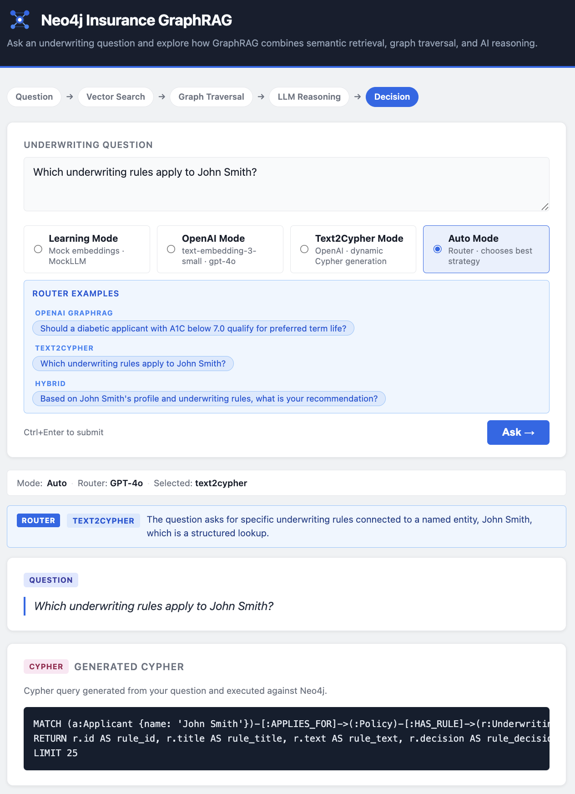
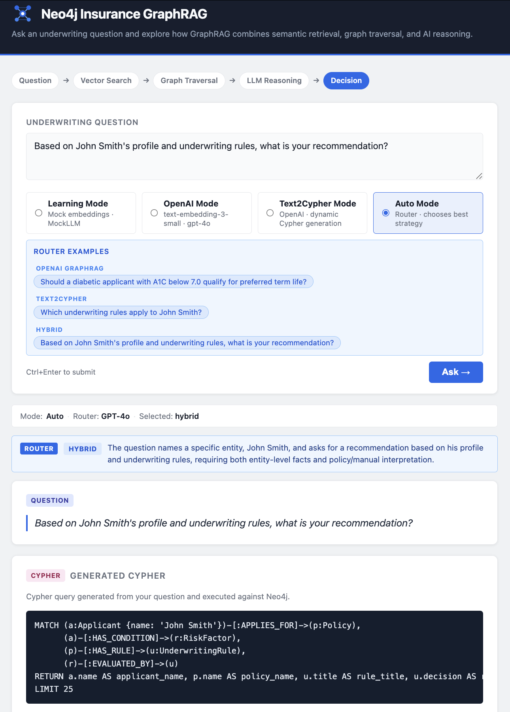

# Neo4j Insurance GraphRAG

A reference implementation demonstrating Graph-augmented Retrieval (GraphRAG) for insurance
underwriting using Neo4j, vector search, and multiple retrieval strategies over a shared knowledge graph.

**Stack:** Neo4j 5 · Python 3.11 · FastAPI · OpenAI · Neo4j Vector Indexes · Custom GraphRAG Pipeline

> **Four modes, one graph.**
>
> This project demonstrates how multiple retrieval strategies can operate against the same Neo4j knowledge graph while sharing a common API contract and domain model.
>
> - **Learning Mode** — Mock embeddings and deterministic business logic. Runs completely offline with zero API cost.
> - **OpenAI Mode** — Uses `text-embedding-3-small` embeddings and `gpt-4o` reasoning while preserving the same graph model and response structure.
> - **Text2Cypher Mode** — GPT-4o generates read-only Cypher, Neo4j executes the query, and GPT-4o synthesizes a final answer. Best suited for structured entity lookups.
> - **Auto Mode** — GPT-4o classifies the question and selects the most appropriate retrieval strategy:
>
>   - `openai_graph` — vector search + graph traversal
>   - `text2cypher` — structured graph lookup
>   - `hybrid` — GraphRAG and Text2Cypher executed in parallel with answer synthesis
>
> The router's decision (`selected_strategy`) and explanation (`router_reason`) are returned in the API response for full transparency.

---

## What This Demonstrates

- GraphRAG retrieval: two-phase vector similarity search followed by structured graph traversal
- Text2Cypher retrieval: natural language to Cypher generation for structured graph lookups
- Auto routing: GPT-4o router selects the best retrieval strategy per question at runtime
- Hybrid retrieval: vector+graph and Text2Cypher run in parallel with synthesized results
- Explainable citations: every decision traces to specific graph nodes — rules, risk factors, manual sections
- Generated Cypher returned in the API response for full auditability of Text2Cypher queries
- Neo4j HNSW vector indexes for semantic similarity retrieval
- GPT-4o integration for embeddings, LLM reasoning, and router classification
- Automatic embedding re-indexing when switching between Learning Mode and OpenAI Mode
- Retrieval strategy selection: four modes selectable per request via the API or browser UI
- Modelling an insurance underwriting domain as a Neo4j knowledge graph
- How graph context (rules, risk factors, policies, applicants) enriches what the LLM receives
- How to expose a retrieval pipeline as a typed, error-handled REST API

---

## Key Concepts Demonstrated

- **Neo4j Knowledge Graph Modeling** — six node types with typed relationships encoding underwriting domain logic
- **Vector Indexes (HNSW)** — Hierarchical Navigable Small World index for approximate nearest-neighbour search over 1536-dimension embeddings
- **GraphRAG Architecture** — vector retrieval and graph traversal as complementary, not competing, retrieval strategies
- **Vector Retrieval + Graph Traversal** — two-phase pipeline: HNSW similarity search followed by Cypher relationship traversal in one round-trip
- **Explainable AI with Citations** — every decision links back to specific graph nodes: manual sections, rules, risk factors
- **FastAPI Service Layer** — typed request/response models, lifespan-managed resources, structured error handling
- **Provider Pattern (Learning Mode vs OpenAI Mode)** — strategy pattern so the pipeline never checks which provider is active; `for_mode()` classmethod handles wiring
- **Embedding Consistency Validation** — stored `embedding_model` metadata detected and auto-reindexed when the mode changes
- **Graph-Based Context Enrichment** — LLM receives structured entities and relationships, not raw text paragraphs
- **Text2Cypher Pattern** — GPT-4o translates natural language to read-only Cypher; result records become structured context for a final answer; guardrails prevent write operations
- **Router-Based Retrieval Orchestration** — GPT-4o zero-shot classification chooses `openai_graph`, `text2cypher`, or `hybrid` per question; router choice and reason returned in the response
- **Hybrid Retrieval** — both vector+graph and Text2Cypher retrievers run for entity-specific recommendation questions; GPT-4o synthesizes a single answer from both result sets

---

## Why GraphRAG?

Standard RAG retrieves text chunks — it cannot tell you *which* applicant has *which* condition, or *which* rules govern that condition for a specific policy. That relational context lives in the graph, not in any single passage.

This system uses a two-phase approach:

1. **Vector search** — embed the question and find the most semantically relevant `DocumentChunk` nodes via Neo4j's HNSW index.
2. **Graph traversal** — walk outward from those chunks through `SUPPORTED_BY → UnderwritingRule → EVALUATED_BY → RiskFactor → HAS_CONDITION → Applicant` to assemble the full reasoning chain in one Cypher round-trip.

The LLM receives **structured entities and relationships**, not raw text paragraphs. Every fact in the answer traces back to a specific graph path — that is the explainability that matters in regulated industries like insurance.

---

## Why Neo4j Instead of Vector-Only RAG?

A pure vector store returns the most similar text passages. That is useful, but in a domain like insurance underwriting, the decision depends on *relationships*, not just text similarity:

- **Vector search** retrieves the most relevant underwriting manual sections (`DocumentChunk` nodes).
- **Graph traversal** follows `SUPPORTED_BY` edges from those chunks to `UnderwritingRule` nodes — the structured decision logic.
- Rules connect via `EVALUATED_BY` to `RiskFactor` nodes — the specific medical or lifestyle conditions being assessed.
- Risk factors connect via `HAS_CONDITION` to the `Applicant` — the person the question is actually about.
- The policy scope is recovered via `HAS_RULE → Policy ← APPLIES_FOR` — ensuring only rules for the correct product are considered.

No single text chunk contains all of this. A vector store would require multiple lookups and manual joining in application code. Neo4j traverses the entire chain in one Cypher query.

**What this adds over vector-only RAG:**

| Property              | Vector-only RAG    | GraphRAG (this project)                             |
| --------------------- | ------------------ | --------------------------------------------------- |
| Retrieval unit        | Text chunk         | Graph path (chunk → rule → risk factor → applicant) |
| Entity awareness      | Inferred from text | Explicit node properties                            |
| Scope                 | All similar text   | Only rules for the relevant policy                  |
| Multi-hop reasoning   | Not supported      | Native — any depth via Cypher                       |
| Citations             | Source document    | Specific rule, risk factor, and manual section      |
| Explainability        | "The manual says…" | Traceable graph path per decision                   |

In regulated industries, the ability to reproduce *exactly* what the system saw — and which rule triggered which decision — is not a nice-to-have. Neo4j makes that auditability structural rather than bolted on.

---

## Architecture

```text
POST /ask  {"question": "...", "mode": "demo"|"openai"|"text2cypher"|"auto"}
      │
      ▼
FastAPI  app/main.py
      │  (lifespan: one Neo4j driver, pipelines for available modes, asyncio.Lock)
      │
      ├── Auto-reindex (if stored embedding model ≠ requested mode's provider)
      │     reindex_embeddings(driver, provider)  ← vectors only, graph unchanged
      │     asyncio.Lock prevents concurrent double-reseed
      │
      ├─── mode: "demo" | "openai"
      │     ▼
      │   GraphRAGPipeline  app/graphrag_pipeline.py
      │     (Learning Mode → MockEmbeddingProvider + MockLLM
      │      OpenAI Mode   → OpenAIEmbeddingProvider + OpenAILLM)
      │     ├── Phase 1 — Vector search
      │     │     provider.embed(question) → db.index.vector.queryNodes()
      │     │     → top-k DocumentChunk nodes + similarity scores
      │     └── Phase 2 — Graph traversal
      │           UNWIND chunk_ids → MATCH rules, risk_factors, policies, applicants
      │           → llm.generate_answer() → {decision, reasoning, citations}
      │
      ├─── mode: "text2cypher"
      │     ▼
      │   Text2CypherService  app/text2cypher_service.py
      │     GPT-4o generates read-only Cypher from question + schema
      │     → Neo4j executes query → raw records
      │     → GPT-4o synthesizes final answer from records
      │     → {generated_cypher, raw_query_results, reasoning}
      │
      └─── mode: "auto"
            ▼
          RetrievalRouter  app/retrieval_router.py
            GPT-4o classifies question → openai_graph | text2cypher | hybrid
            → routes to GraphRAGPipeline, Text2CypherService, or both
            → {selected_strategy, router_reason, …combined fields…}
```

This implementation supports multiple retrieval strategies operating against a shared Neo4j knowledge graph:

- **Learning Mode and OpenAI Mode** use the two-phase GraphRAG pipeline: vector similarity search followed by graph traversal.
- **Text2Cypher Mode** uses GPT-4o to generate read-only Cypher queries and synthesize answers from Neo4j query results.
- **Auto Mode** routes each question to the most appropriate retrieval strategy.
- **Hybrid retrieval** executes GraphRAG and Text2Cypher in parallel and synthesizes a single answer.

Retrieval strategy should match question type:

- Semantic policy and underwriting questions benefit from GraphRAG.
- Structured entity lookups benefit from Text2Cypher.
- Recommendation-style questions that require both entity facts and policy interpretation often benefit from Hybrid retrieval.

---

## Graph Model

```text
(Applicant) -[:APPLIES_FOR]→    (Policy)
(Applicant) -[:HAS_CONDITION]→  (RiskFactor)
(Applicant) -[:HAS_LAB_RESULT]→ (LabResult)
(Policy)    -[:HAS_RULE]→       (UnderwritingRule)
(RiskFactor)-[:EVALUATED_BY]→   (UnderwritingRule)
(UnderwritingRule)-[:SUPPORTED_BY]→ (DocumentChunk)  ← embeddings live here
```

DocumentChunk nodes carry vector embeddings. UnderwritingRule nodes carry structured
decision logic. The graph connects them: vector search finds the chunk, traversal finds
the rule, rule links to the risk factor and applicant. No single text chunk contains all of this.

---

## Modes

Mode is selected **per request** via the `mode` field in the API (or the browser UI).
The server initializes all available pipelines and services at startup based on configuration.

### Learning Mode (default — no API key needed)

Mock embeddings (SHA-256 hash) + MockLLM (deterministic business logic). Free, offline, instant.

Pass `"mode": "demo"` in the request body.

### OpenAI Mode (requires `OPENAI_API_KEY`)

Real semantic embeddings (`text-embedding-3-small`) + `gpt-4o` reasoning over graph context.

```bash
# .env — only this is needed
OPENAI_API_KEY=sk-...
```

Pass `"mode": "openai"` in the request body.

> **Auto-reindex:** Switching modes re-embeds all `DocumentChunk` nodes automatically on
> the first request in that mode — no manual `python3 -m app.seed` required.
> Only the embedding vectors are updated; the graph structure is unchanged.
> The first request after a mode switch takes a few extra seconds while re-indexing runs.

### Text2Cypher Mode (requires `OPENAI_API_KEY`)

Natural language → GPT-4o generates Cypher → executed against Neo4j → GPT-4o synthesizes answer.
No vector embeddings or graph traversal. Suited for structured lookups: lists, counts, filters.

Pass `"mode": "text2cypher"` in the request body.

### Auto Mode (requires `OPENAI_API_KEY`)

GPT-4o classifies the question and routes it to the best retrieval strategy:

| Router decision | Strategy used                                                             |
|-----------------|---------------------------------------------------------------------------|
| `openai_graph`  | Vector search + graph traversal + GPT-4o (semantic / policy questions)    |
| `text2cypher`   | NL -> Cypher -> graph records -> GPT-4o (structured entity lookups)       |
| `hybrid`        | Both strategies run in parallel; GPT-4o synthesizes a single final answer |

Hybrid is selected when a question names a specific entity *and* asks for a recommendation
or explanation that also requires policy/manual interpretation.

The response includes `selected_strategy` (what the router chose) and `router_reason`
(a one-sentence explanation). For text2cypher and hybrid responses, `generated_cypher` and `raw_query_results` are included.

For hybrid responses, these appear alongside the full GraphRAG graph context.

Pass `"mode": "auto"` in the request body.

> **Production note:** The router uses GPT-4o zero-shot classification. For production use,
> validate routing accuracy against a golden dataset of labelled questions before relying
> on it for high-stakes decisions.

---

## Screenshots

### Knowledge Graph Model



Neo4j graph model representing applicants, policies, risk factors, underwriting rules, and document chunks.

---

### Application Home Page



Unified interface supporting Learning Mode, OpenAI Mode, Text2Cypher Mode, and Auto Mode.

---

### GraphRAG Retrieval



Vector similarity search retrieves relevant document chunks and expands context through graph traversal.

---

### GraphRAG Decision and Citations



Decision generation, reasoning, and explainable citations derived from graph context.

---

### Text2Cypher Retrieval



Natural language is translated into Cypher, executed against Neo4j, and synthesized into a user-friendly answer.

---

### Auto Router — OpenAI GraphRAG



Router selects openai_graph for semantic and policy interpretation questions.

---

### Auto Router — Text2Cypher



Router selects text2cypher for structured graph lookup questions.

---

### Auto Router — Hybrid Retrieval



Router selects hybrid retrieval when both structured graph facts and semantic reasoning are required.

---

## How to Run

```bash
docker compose up -d
pip install -r requirements.txt
python3 -m app.seed          # initial graph setup only — run once
uvicorn app.main:app --port 8765 --reload
```

Then open <http://127.0.0.1:8765> in your browser for the interactive GraphRAG application.

`python3 -m app.seed` is only needed once to populate the graph. Switching between Learning Mode and
OpenAI Mode in the UI re-indexes embeddings automatically — no manual re-seed required.

API docs (Swagger): <http://127.0.0.1:8765/docs>

> Ports 8000 and 8001 conflict with Docker on some machines — use 8765 or any free port.

---

## User Interface Layer

The root URL (`/`) serves a single-page application that visualises every pipeline step:

| Section | What it shows |
| ------- | ------------- |
| Mode selector | Four mode cards: Learning Mode · OpenAI Mode · Text2Cypher Mode · Auto Mode |
| Example question strips | Per-mode clickable pill buttons that fill the textarea — hidden for inactive modes |
| Provider bar | Active mode, embedding model, and LLM; for Auto Mode shows Router and Selected strategy |
| Router reason callout (blue, Auto Mode only) | Strategy badge + one-sentence explanation of the routing decision |
| Auto-reindex notice (green) | Appears once when embeddings were automatically re-indexed for the selected mode |
| Embedding mismatch warning (amber) | Appears only if auto-reindex failed (e.g. network error during OpenAI call) |
| Generated Cypher (Text2Cypher / hybrid) | Cypher query generated from the question and executed against Neo4j |
| Raw Query Results (Text2Cypher / hybrid) | Records returned directly from Neo4j as a table |
| Phase 1 — Vector Search (GraphRAG / hybrid) | Matched DocumentChunk nodes with source and similarity score |
| Phase 2 — Graph Traversal (GraphRAG / hybrid) | Applicant, policies, risk factors, underwriting rules pulled from the graph |
| Final Decision (GraphRAG / hybrid) | Colour-coded badge (APPROVE / REFER\_FOR\_REVIEW / REQUIRE\_ADDITIONAL\_REVIEW / DECLINE) |
| Reasoning / Answer | Numbered explanation from the LLM; labelled "Answer" in Text2Cypher mode |
| Citations (GraphRAG / hybrid) | Each DocumentChunk source and UnderwritingRule that supported the decision |

No React. No build step. Plain HTML + CSS + JavaScript served by FastAPI.

---

## Sample Request (curl)

```bash
# Learning Mode (default — no API key required)
curl -X POST http://127.0.0.1:8765/ask \
  -H "Content-Type: application/json" \
  -d '{"question":"Should a diabetic applicant with A1C below 7.0 qualify for preferred term life?","mode":"demo"}'

# OpenAI Mode (requires OPENAI_API_KEY in .env)
curl -X POST http://127.0.0.1:8765/ask \
  -H "Content-Type: application/json" \
  -d '{"question":"Should a diabetic applicant with A1C below 7.0 qualify for preferred term life?","mode":"openai"}'

# Text2Cypher Mode — structured graph lookup (requires OPENAI_API_KEY)
curl -X POST http://127.0.0.1:8765/ask \
  -H "Content-Type: application/json" \
  -d '{"question":"Which underwriting rules apply to John Smith?","mode":"text2cypher"}'

# Auto Mode — router selects strategy (requires OPENAI_API_KEY)
curl -X POST http://127.0.0.1:8765/ask \
  -H "Content-Type: application/json" \
  -d '{"question":"Based on John Smith'\''s profile and underwriting rules, what is your recommendation?","mode":"auto"}'
```

**Response:**

```json
{
  "question": "Should a diabetic applicant with A1C below 7.0 qualify for preferred term life?",
  "decision": "REFER_FOR_REVIEW",
  "reasoning": [
    "Type 2 Diabetes is present in the applicant's risk profile — a chronic condition that triggers mandatory underwriting review.",
    "A1C is controlled (below 7.0 threshold) — the condition is actively managed, which favourably adjusts the severity assessment.",
    "Preferred class requires underwriting review for any chronic condition, even when controlled.",
    "No tobacco use is recorded, which provides a favourable lifestyle adjustment to the overall risk profile."
  ],
  "supporting_rules": [
    {"id": "rule_002", "title": "Controlled Diabetes Review",        "decision": "REFER_FOR_REVIEW"},
    {"id": "rule_003", "title": "Tobacco Use Classification",        "decision": "APPROVE_FACTOR"}
  ],
  "risk_factors": [
    {"name": "Type 2 Diabetes", "category": "chronic_condition"},
    {"name": "Controlled A1C",  "category": "lab_marker"},
    {"name": "No Tobacco Use",  "category": "lifestyle"}
  ],
  "citations": [
    {"type": "DocumentChunk",    "source": "Underwriting Manual v3.2, Section 6.3", "relevance_score": 0.506},
    {"type": "DocumentChunk",    "source": "Underwriting Manual v3.2, Section 6.5", "relevance_score": 0.513},
    {"type": "UnderwritingRule", "title": "Controlled Diabetes Review",              "decision": "REFER_FOR_REVIEW"}
  ],
  "retrieval_summary": {
    "matched_chunks": 3,
    "rules": 3,
    "risk_factors": 3,
    "policies": 1,
    "applicants": 1
  },
  "mode": "demo",
  "embedding_provider": "mock",
  "llm_provider": "MockLLM",
  "compatibility_warning": null,
  "reindexed": false
}
```

---

## Run Without the API

```bash
python3 -m app.graphrag_pipeline
```

---

## Endpoints

| Method | Path     | Description                              |
| ------ | -------- | ---------------------------------------- |
| GET    | /health  | Liveness check                           |
| POST   | /ask     | Submit a question, get a GraphRAG answer |

Interactive docs (Swagger UI): `http://127.0.0.1:8765/docs`

**Error codes:**

| Code | Cause                              |
|------|------------------------------------|
| 400  | `question` field is blank          |
| 503  | Neo4j is unreachable               |
| 500  | Unexpected server error            |

---

## Components by Mode

| Component | Learning Mode | OpenAI Mode | Text2Cypher Mode | Auto Mode |
| --- | --- | --- | --- | --- |
| Embeddings | SHA-256 hash (not semantic) | `text-embedding-3-small` | None | `text-embedding-3-small` (if routed to graph) |
| LLM | Deterministic Python logic | `gpt-4o` | `gpt-4o` | `gpt-4o` (router + answer) |
| Retrieval | Vector search + graph | Vector search + graph | NL → Cypher → graph records | Router-selected: graph / cypher / hybrid |
| Graph traversal | Yes | Yes | No (direct Cypher execution) | Depends on selected strategy |
| API key needed | No | Yes | Yes | Yes |
| Cost | Zero | OpenAI API charges apply | OpenAI API charges apply | OpenAI API charges apply |

Switch modes using the selector in the browser UI or the `mode` field in the API request.
Embeddings are re-indexed automatically on the first request in a new mode.
The graph model, traversal queries, and API contract are identical across all modes.

---

## Production Deployment Considerations

1. **OpenAI mode is already implemented** — set `OPENAI_API_KEY` in `.env` and select
   OpenAI Mode in the browser. Embeddings re-index automatically on the first request.
   The graph model and API contract are unchanged.
2. **Scale** — the schema supports any number of applicants, policies, and rules. Retrieval
   performance scales logarithmically with data volume through Neo4j's HNSW index (O(log n) rather than O(n) linear scan).
3. **Auth + observability** — add `Depends()` middleware for API key or JWT auth. Log
   `retrieval_summary` counts to detect retrieval quality drift over time.
4. **Additional LLM providers** — add any new LLM class following the same interface as
   `MockLLM` and `OpenAILLM`. No pipeline changes required.

---

## Topics Explored

Technical patterns implemented in this reference:

- **Knowledge Graph Modeling** — designing a property graph schema for a relationship-heavy domain; choosing which facts belong on nodes vs. relationships
- **Cypher Graph Traversal** — multi-hop `MATCH` and `OPTIONAL MATCH` queries; batching via `UNWIND` to minimise round-trips
- **Neo4j HNSW Vector Indexes** — creating and querying an HNSW approximate nearest-neighbour index; understanding what similarity scores mean in practice
- **GraphRAG Architecture** — combining vector retrieval and graph traversal so each phase handles what it does best
- **Vector Retrieval** — embedding text, storing vectors as node properties, querying via `db.index.vector.queryNodes()`
- **Graph-Based Context Enrichment** — traversing from retrieved chunks to connected rules, risk factors, applicants, and policies in one query
- **Explainable AI** — building citations that trace every decision back to a specific graph node rather than a raw text passage
- **OpenAI Embeddings (`text-embedding-3-small`)** — calling the embeddings API, storing results in Neo4j, and handling model/vector consistency across requests
- **LLM Grounding and Citations** — using `gpt-4o` with JSON mode over structured graph context; normalising response shapes across providers
- **FastAPI Service Design** — lifespan-managed resources, typed Pydantic models, async request handling with `asyncio.to_thread()`
- **Provider Abstraction Pattern** — strategy pattern so the pipeline is provider-agnostic; `for_mode()` classmethod handles all wiring
- **Embedding Consistency Validation** — detecting stored vs. active embedding model mismatches and auto-reindexing before the query runs
- **Text2Cypher Pattern** — NL-to-Cypher generation with schema grounding; read-only execution guardrails; structured graph lookups without vector search
- **Router-Based Retrieval Orchestration** — GPT-4o zero-shot routing; strategy selection at query time; transparent `selected_strategy` and `router_reason` in every response
- **Hybrid Retrieval** — running both retrievers in parallel and synthesizing a single answer from combined graph and Cypher context

---

## Project Structure

```text
static/
  index.html              — single-page application UI
  styles.css              — no external CDN dependencies
  app.js                  — fetch /ask, render each pipeline section
  favicon.svg             — browser favicon and header icon
app/
  config.py               — Neo4j connection settings (dotenv)
  graph.py                — driver factory + run_query helper
  embed.py                — MockEmbeddingProvider (SHA-256) and OpenAIEmbeddingProvider (text-embedding-3-small)
  seed.py                 — constraints, seed nodes/relationships, attach embeddings; reindex_embeddings() for auto mode switching
  vector_index.py         — create/verify HNSW vector index, similarity_search()
  graph_retriever.py      — GraphRetriever: two-phase vector + graph retrieval
  mock_llm.py             — MockLLM: deterministic underwriting decision logic
  openai_llm.py           — OpenAILLM: GPT-4o reasoning with structured JSON responses
  graphrag_pipeline.py    — GraphRAGPipeline: retriever → LLM → structured answer
  text2cypher_service.py  — Text2CypherService: NL → GPT-4o → Cypher → Neo4j → GPT-4o answer
  retrieval_router.py     — RetrievalRouter: GPT-4o classifies question, routes to openai_graph / text2cypher / hybrid
  main.py                 — FastAPI app: POST /ask, GET /health, error handling
data/
  underwriting_sample.json  — seed data source of truth (all nodes + relationships)
docs/
  images/
    01-home-page.png
    02-graphrag-retrieval.png
    03-graphrag-decision.png
    04-text2cypher.png
    05-auto-router-openai.png
    06-auto-router-text2cypher.png
    07-auto-router-hybrid.png
    08-graph-model.png
docker-compose.yml          — Neo4j 5 service with APOC plugin
requirements.txt            — Python dependencies
README.md                   — project overview, architecture summary, setup instructions, screenshots, and usage guide
ARCHITECTURE.md             — detailed design and implementation architecture
CYPHER_QUERIES.md           — Cypher reference queries for GraphRAG and Text2Cypher validation
```
